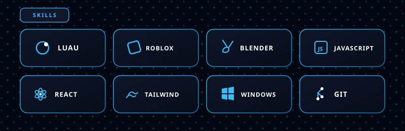
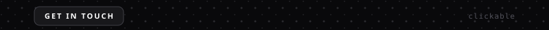
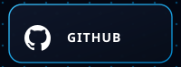
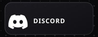
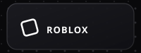
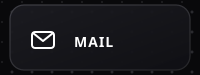
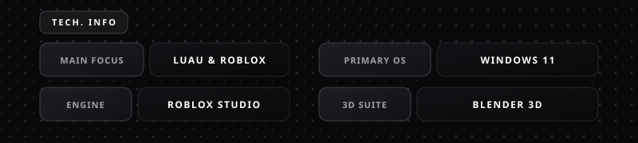
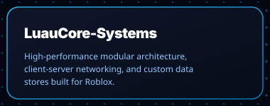
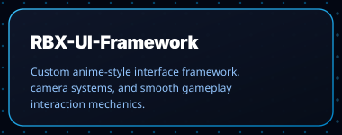
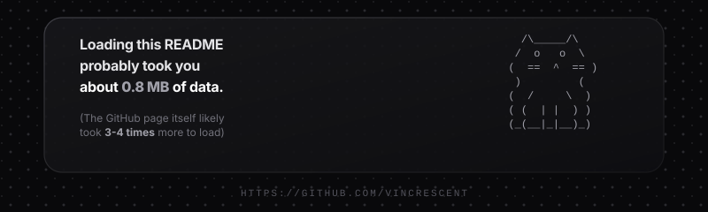

  
  
   

  

   

  
  
  

 

  

  

  

  <nobr>
    
    
    
    
  </nobr>

  

  

  <nobr>
    
    
  </nobr>

 

## 📊 GitHub Analytics

  <table border="0">
    <tr>
      <td>
        
      </td>
      <td>
        
      </td>
    </tr>
  </table>

   

  

 

  

