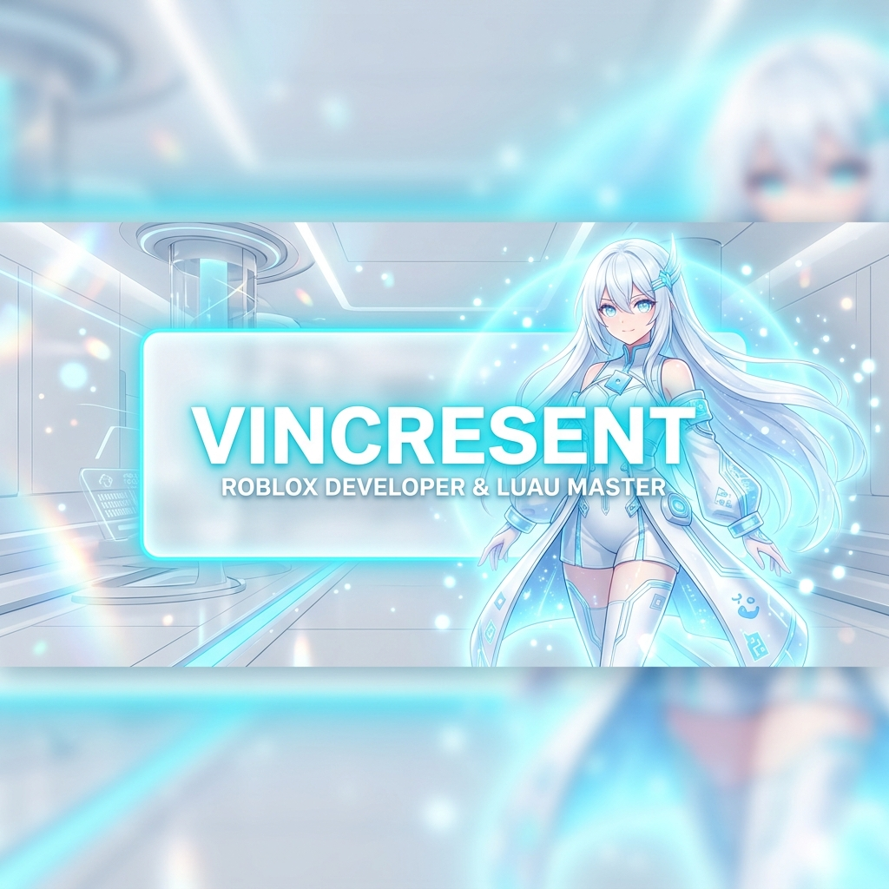
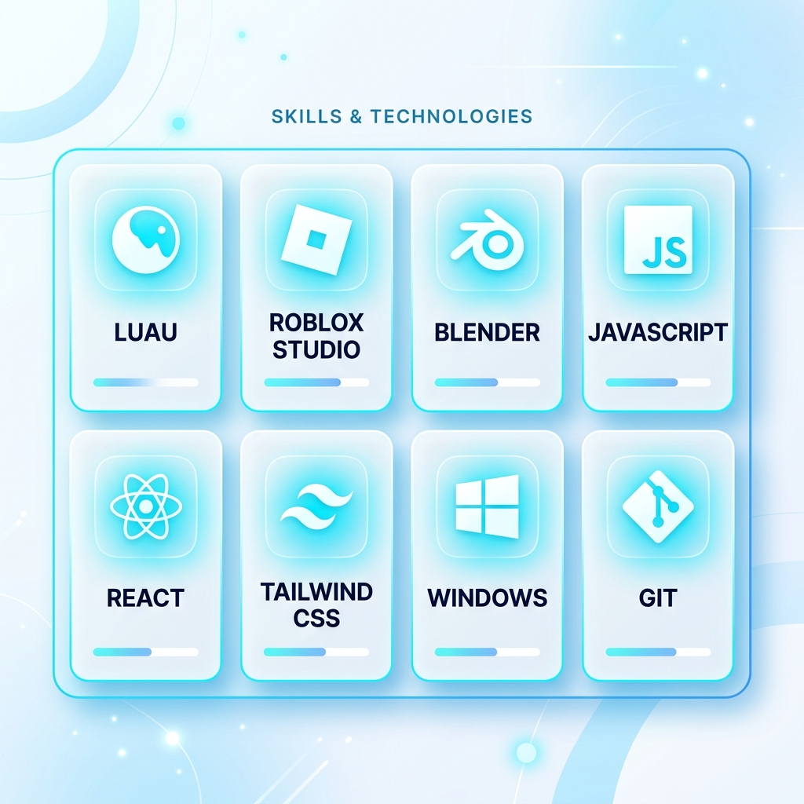
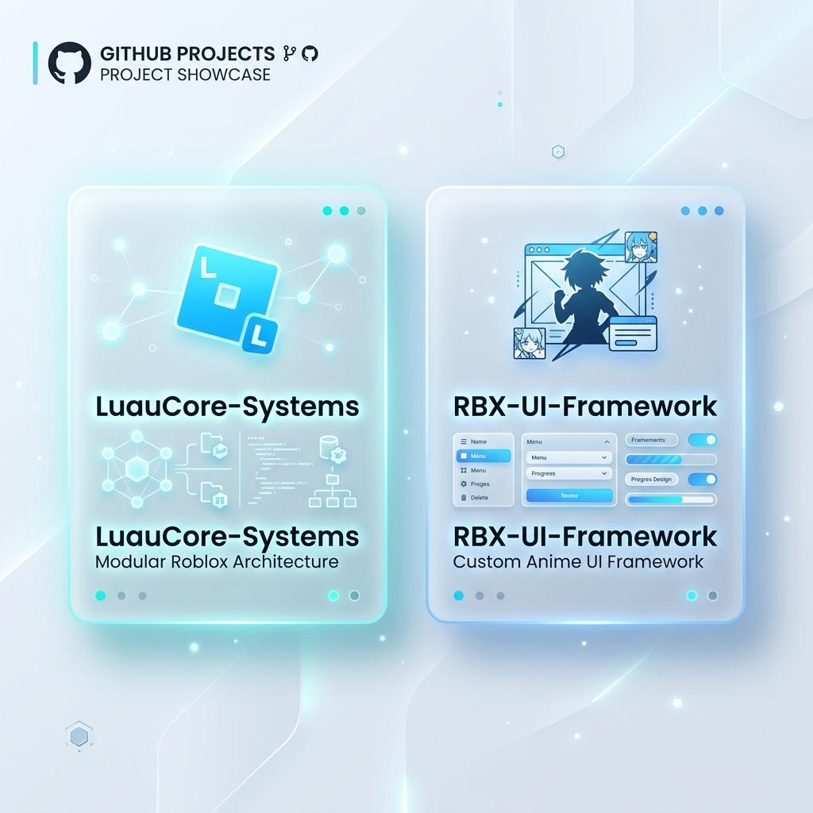

  <!-- Main Generated High Resolution White & Ice Blue Banner -->
  

    

  <!-- Typing SVG in Cyan / Ice Blue -->
  

    

  <!-- Light Theme Badges -->
  
  
  

 

## ❄️ About Me

<table border="0" width="100%">
  <tr>
    <td width="65%" valign="top">
       
      
✨ <b>Roblox Developer &amp; Luau Specialist</b> based in Indonesia 🇮🇩.

      
🎮 Focused on building <b>modular client-server game systems</b>, custom gameplay mechanics, and optimized networking.

      
🎨 Crafting <b>anime-inspired aesthetics</b>, fluid UI/UX interfaces, and 3D modeling in Blender.

      
💻 Full-stack capabilities in <b>JavaScript, React, and Tailwind CSS</b>.

    </td>
    <td width="35%" align="center" valign="middle">
      
    </td>
  </tr>
</table>

 

## 🛠️ Tech Stack & Skills Showcase

  

 

  
  
  
  
  
  
  

 

## ⚡ Current Working On...

  

 

## 📫 Connect With Me

  
  &nbsp;
  
  &nbsp;
  
  &nbsp;
  

 

  Designed with ❄️ &amp; ❤️ by Vincrescent | <i>"Turning anime dreams into playable worlds."</i>

